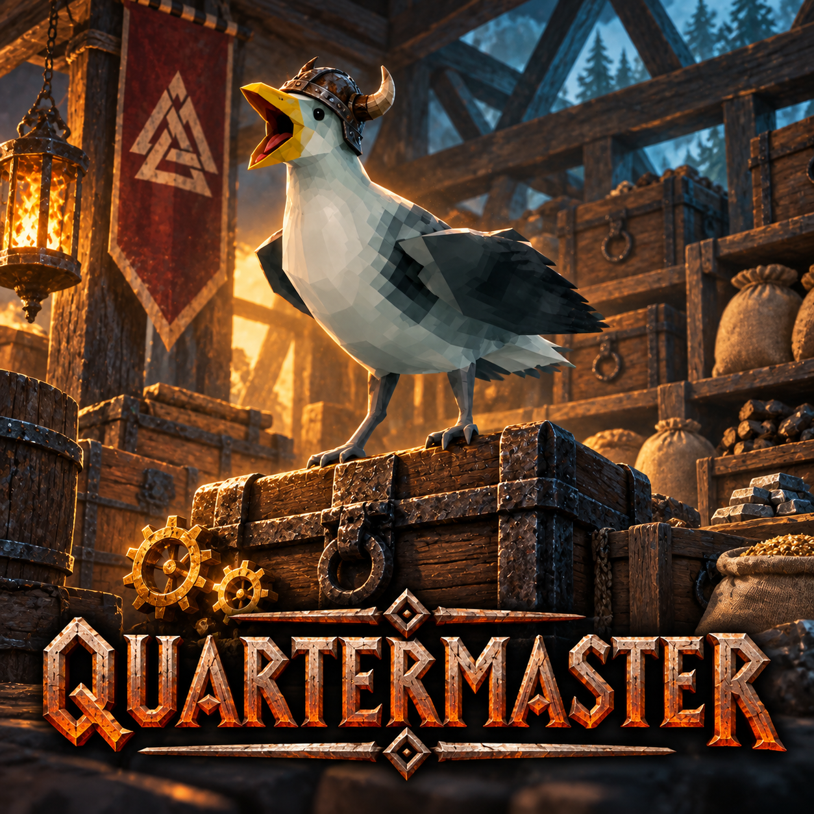

# Quartermaster

**SKRAAA! Twelve chests of “miscellaneous”? You're running a landfill, Viking.**

Give me a Deposit Chest. I'll sort supplies into storage that remembers its contents, help feed crafting and production, keep fires supplied and mind the animals. Production caps prevent a kingdom made entirely of coal.

Helmet included. I toss trinkets while sorting, peck at unsorted leftovers and keep an eye on you between jobs. Glowing gears and runes, too.

**Requires BepInEx.** Disable **Hearthkeeper** and **AutomaticFermenters** first.

Open a chest → **Chest Config → Use as Deposit Chest**. Aim at a machine and press **F9** for its settings.

**Multiplayer untested.** I cannot count turnips in an unloaded shed.

[GitHub](https://github.com/Vassteel/Quartermaster) · [Discord](https://discord.gg/abN7R2tWyK) · [Guide](GUIDE.md) · [Validation](VALIDATION.md)

Based on Hearthkeeper. Code, artwork and documentation developed with generative AI.
